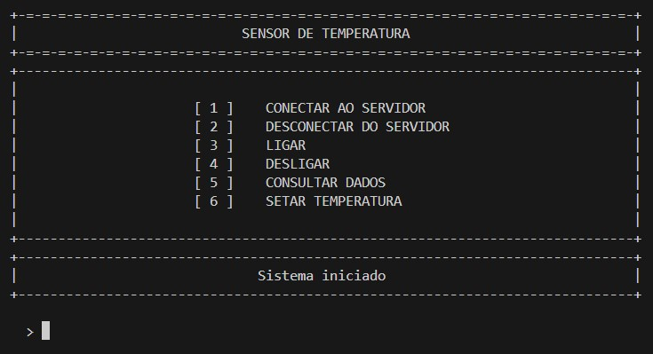
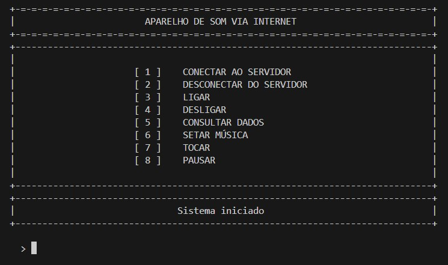
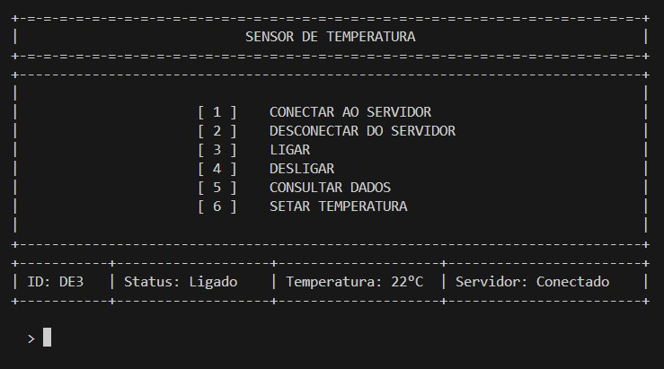
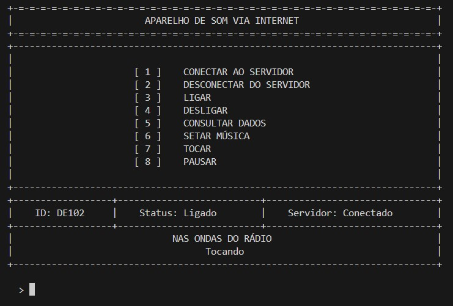
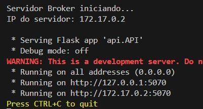
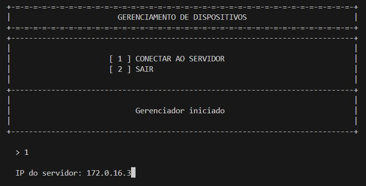
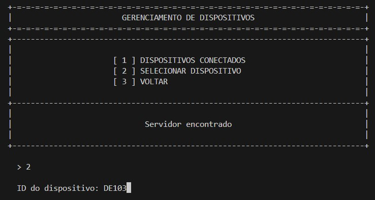
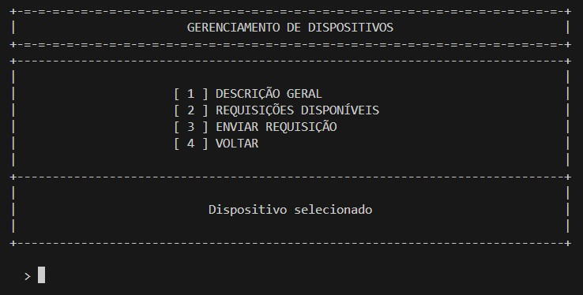

<h1 align="center"> Internet das Coisas </h1>
<h3 align="center"> Projeto de comunicação e gerenciamento de dispositivos. </h3>  

 
<h2> Sobre o Projeto</h2>

 

Em decorrência da crescente evolução tecnológica dos últimos anos, o surgimento de uma revolução que mudará o estilo de vida dos indivíduos é agora uma realidade iminente. Uma dessas importantes mudanças é a interconexão entre dispositivos com acesso a internet. Essa capacidade de acessar diferentes funcionalidades e dados a partir de vários periféricos representa o conceito de internet das coisas (IoT).

No intuito de auxiliar a inserção de novos dispositivos nas inovações atuais de comunicação de rede, foi desenvolvido um projeto de conexão e troca de mensagens entre diversos periféricos. Esse sistema consiste na ligação de dispositivos e aplicações de gerenciamento por meio de um intermediário que desempenha o papel de um servidor broker. Isso torna possível que aplicações para o usuário recebam dados e gerenciem dispositivos remotamente.

A seguir, as requisições dos softwares criados e as suas especificações:

* **Dispositivo vitual:**
	* Criação de um ou mais softwares, em qualquer linguagem de programação, para simulação de dispositivos capazes de desempenhar funcionalidades e gerar dados fictícios de retorno;
	* Deve-se utilizar um protocolo baseado em conexão (TCP) para lidar com comandos de gerenciamento, e um protocolo sem conexão (UDP) para envio de dados; 
	* Implementação de uma interface via terminal para inserção de parâmetros de gerenciamento e setagem de dados.
	* A comunicação deve ser baseada em conexões socket, sendo elas, conexões que seguem o protocolo de rede TCP/TP.

* **Broker:**
	* Implementação de um servidor intermediário entre as aplicações e os dispositivos, com base em interface  API RESTful;
	* Podem ser usados frameworks de construção da API RESTful para a comunicação entre o servidor broker e a aplicação.

* **Aplicação de gerenciamento:**
	* Criação de uma aplicação com interface, gráfica ou não, que permite a conexão com dispositivos, por intermédio do servidor broker, para enviar comandos e solicitar requisições.

*Desenvolvedor:* Silvio Azevedo de Oliveira

<h1 align="center"> Sumário </h1>

	<ul>
		<li><a href="#descricaoSoftwares"> Descrição dos principais softwares utilizados </a></li>
		<li><a href="#arquiteturaSolucao"> Arquitetura da solução </a></li>
		<li><a href="#dispositivos"> Dispositivos </a> </li>
		<li><a href="#broker"> Broker </a> </li>
		<li><a href="#tratamentoConcorrencia"> Tratamento de concorrência entre threads </a> </li>
		<li><a href="#aplicacaoGerenciamento"> Aplicação de gerenciamento </a> </li>
		<li><a href="#formatoMensagens"> Formato das mensagens </a> </li>
		<li><a href="#execucao"> Execução </a> </li>
		<li><a href="#conclusao">Conclusão </a> </li>
		<li><a href="#referencias"> Referências </a> </li>
	</ul>	

 <h2> Descrição dos principais softwares utilizados </h2>

 

A seguir, a descrição dos principais softwares utilizados para execução e testagem do projeto, e construção da comunicação de rede.

**Linguagem de Programação Python**

Foi decidido desenvolver o projeto utilizando a linguagem de programação python, versão 3.12, pela facilidade de acessar funcionalidades e bibliotecas necessários para a implementação de uma comunicação de rede.

**Biblioteca Socket**

A biblioteca Socket em Python foi usada para estabelecer conexões e enviar dados entre diferentes dispositivos. Ela suporta os dois protocolos de transmissão utilizados na comunicação dos dispositivos com o servidor broker, sendo eles, o TCP e o UDP.

No estabelecimento de uma conexão (TCP), os objetos socket são úteis para detectar erros no processo de comunicação e setar condições de envio e recebimento, como, intervalos de tempo limite para se receber uma resposta.

**Biblioteca Flask**

A biblioteca Flask em Python foi utilizada para implementar a API RESTful do servidor broker. É caracterizada como um micro-framework com foco em projetos simples e menores. Porém, mesmo com o objetivo em criar microsserviços, possui rapidez no desenvolvimento e é personalizável, permitindo o desenvolvimento de arquiteturas mais estruturadas.

**Biblioteca Requests**

Como a API do tipo RESTful segue o procolo de comunicação HTTP, foi usada a biblioteca requests para acessar os endereços com seus métodos devidamente indicados.

**Docker**

A plataforma Docker foi utilizada para executar os programas criados. Se trata de uma tecnologia de empacotamento de aplicações, facilitando o seu compartilhamento e execução em diferentes máquinas. 

**Insomnia**

O programa Insomnia foi usado para testar as rotas da API RESTful sem precisar de um arquivo Python implementando a biblioteca requests.

 <h2> Arquitetura da Solução </h2>

 

A estrutura geral do projeto é representada pela comunicação entre as três entidades do sistema, sendo elas: o servidor broker, o dispositivo e a aplicação de gerenciamento do usuário. O número de dispositivos e aplicações podem variar, somente o servidor broker é único para aquela determinada comunicação de rede. Assim, seguindo as indicações de protocolo das requisições, o sistema de rede segue a seguinte estrutura:

  

<strong> Estrutura geral do sistema </strong> 

A seguir, as especificações de comunicação entre as três entidades.

### Processo de conexão: dispositivo e broker

O dispositivo é a entidade que inicia a conexão com o broker, utilizando o canal de comunicação TCP. Esse processo segue os seguintes passos:

1. Dispositivo envia o sinal de início de conexão, do socket, para o broker aceitar; 
2. Dispositivo envia uma mensagem indicando que o intuito da conexão é criar uma comunicação fixa com o broker;
3. Broker envia o ID que foi setado para o dispositivo;
4. Dispositivo envia a descrição dos seus comandos;
5. As duas entidades setam os seus dados internos com as informações recebidas e a conexão é estabelecida.

Os passos citados são representados no diagrama abaixo:

  

<strong> Iníciando conexão entre o dispositivo e o broker </strong> 

Para manter a conexão entre o dispositivo e o broker, foi implementado um sistema de confirmação periódica. Isso foi feito setando para os dois objetos socket, das extremidades da comunicação, um intervalo limite de 5 segundos para receber respostas. 

O dispositivo espera por alguma mensagem a todo momento, e o broker envia a cada 3 segundos comandos de confirmação de conexão. Se o dispositivo não receber nada no intervalo limite, ocorreu um erro de conexão.

No caso de erro de conexão, o dispositivo inicia o processo de reconexão. Isso é feito criando um novo objeto socket auxiliar que tentará iniciar uma nova conexão com o broker repetidamente, porém, não será para criar uma conexão fixa, mas, sim, para o broker retornar se a conexão anterior ainda está armazenada ou não. Se ela estiver, o processo de esperar requisições continua normalmente, se não, é feito um novo processo para reiniciar a conexão.

O caso de desconexão citado está sendo mostrado no diagrama abaixo:

  

<strong> Reconexão entre o dispositivo e o broker </strong> 

O dispositivo pode desfazer a conexão se for pelo seu gerenciamento interno. O broker saberia que o canal de comunicação foi encerrado, e, em seguida, descartaria a conexão da mesma forma.

### Processo de conexão: broker e aplicação

A aplicação de gerenciamento se comunica com o broker através de chamadas da biblioteca requests, assim, não é preciso manter uma conexão fixa. 

Para enviar comandos a algum dispositivo conectado, é preciso saber previamente informações de envio, como, se é necessário a entrada de um novo dado, e qual método HTTP deve ser usado na chamada. Por esse motivo, o dispositivo envia a descrição dos seus comandos quando inicia a conexão com o broker, como foi citado anteriormente. 

Dessa forma, quando a aplicação tenta enviar um comando a algum dispositivo, primeiramente, é retornado do broker a descrição desse comando, e depois, as preparações são feitas para fazer corretamente o envio para o dispositivo.

### Processo de conexão: dispositivo e aplicação

Com a conexão do dispositivo e do broker estabelecida, é possível fazer o intermédio entre a aplicação e o dispositivo. O processo de comunicação pode seguir duas linhas de sequência diferentes, sendo elas: enviar comandos de gerenciamento ao dispositivo, por meio do canal de comunicação TCP, ou fazer requisição de coleta de dados que são enviados do dispositivo para o broker via canal de comunicação UDP.

O protocolo TCP é usado para conexões fixas que necessitam de uma lógica de envio e recebimento de dados envolvendo as duas extremidades da comunicação. Por esse motivo, ele foi usado para o envio de comandos de gerencimanto, em que, a aplicação envia um comando, pelo broker, para o dispositivo executar alguma ação, e é esperada uma resposta do resultado dessa ação. A sequência de mensagens desse caso é descrita no diagrama abaixo:

  

<strong> Envio de comandos de gerenciamento </strong> 

O protocolo UDP não é orientado a uma conexão fixa, ou seja, não possui estrutura dependente de retorno ao enviar um dado. Assim, ele foi usado para envio de dados de sensoriamento, do dispositivo para o broker, que não necessitam de uma garantia de chegada ao destino. Nesse caso, a aplicação envia comandos relacionados a coleta de dados transmitidos via canal UDP, e o dispositivo não precisa saber que esses dados foram requisitados, já que o broker já está recebendo-os. O diagrama abaixo mostra essa situação: 

  

<strong> Envio de requisição de dados </strong> 

 <h2> Dispositivos </h2>

 

Foram implementados dois dispositivos, sendo eles, um sensor de temperatura e um aparelho de som via internet, que no projeto é referenciado como um radio. A seguir, serão descritos os módulos e as interfaces de exibição dessas entidades, com lógicas implementadas no diretório "device".

**model**

A pasta "model" contém a estrutura das classes usadas no projeto. Foram feitas três classes, uma para cada dispositivo e outra representando a conexão com o servidor. Os arquivos contendo essas estruturas são:

* **Connection_device:** contém a classe da conexão com o servidor. Na sua inicialização são setadas as portas 5050, para o canal de comunicação TCP, e 5060, para o canal UDP. Os dados necessários para realizar a conexão futura com o servidor são setados. Os seus métodos consistem na inicialização e encerramento da conexão com o servidor, e o *loop* de reconexão, caso haja problemas na comunicação.

* **Sensor e Radio:** contém as classes que representam o sensor de temperatura e o aparelho de som via internet, respectivamente. Na sua inicialização são setadas as informações básicas do dispositivo. Seus métodos consistem no retorno e setagem de dados, e na lógica de execução dos possíveis comandos;

**impl**

A pasta "impl" contém os arquivos com a lógica de implementação dos dispositivos. Estão inclusas as funções de exibição do menu, para gerenciar comandos pelo próprio dispositivo, e do recebimento de requisições do servidor, se estiver conectado.

O sensor de temperatura possui o seguinte protocolo de requisições que podem ser recebidas através de envios do broker:

| Comando  | Descrição |
| ------------- | ------------- |
| 0  | Confirmar validade da comunicação |
| 1  | Ligar sensor |
| 2  | Desligar sensor |
| 4  | Retornar descrição geral do sensor |

A requisição de número 3 representaria o envio da medida de temperatura, mas esse dado é enviado periodicamente pelo canal de comunicação UDP, portanto, ele não é recebido. 

O protocolo de possíveis requisições para o radio são:

| Comando  | Descrição |
| ------------- | ------------- |
| 0  | Confirmar validade da comunicação |
| 1  | Ligar radio |
| 2  | Desligar radio |
| 3  | Setar música |
| 4  | Tocar música |
| 5  | Pausar música |
| 6  | Retornar descrição geral do dispositivo |

O retorno da descrição geral dos dispositivo é sempre o último comando do protocolo, e o envio de confirmação da conexão é sempre o comando 0. O restante dos comandos seguem a ordem que é exibida para o usuário, que utiliza a aplicação de gerenciamento, quando ele solicita os comandos disponíveis. A descrição geral é uma opção fixa no menu da aplicação, por esse motivo, não fica na lista dos comandos disponíveis.

Diferentemente do sensor, o radio não possui uma função para envio periódico de dados via canal de comunicação UDP. Ao invés disso, a aplicação pode setar uma música específica para ser setada, desempenhando o papel de um dispositivo atuante.

**exec**

A pasta "exec" contém a execução dos programas dos dispositivos, feita, especificamente, no arquivo \__main__. Primeiramente são declarados os objetos representando o dispositivo e a conexão com o servidor, posteriormente, são chamadas as funções necessárias.

Para o sensor de temperatura são chamadas três funções, sendo elas: o *loop* de recebimento das requisições do servidor, o envio periódico de dados pelo canal de comunicação UDP, e a exibição do menu de gerenciamento do dispositivo. Os dois primeiros são executados em *threads* separadas, portanto as três funções executam em modo pseudo paralelo.

O radio segue a mesma lógica de execução do sensor, com exceção do envio periódico de dados pelo canal de comunicação UDP, que não é implementado por ele.

**Interface de exibição**

Para o gerenciamento do dispositivo em seu próprio terminal, são exibidos fixamente os comandos disponíveis e informações, na parte inferior, relacionadas a situação atual ou as opções que foram inseridas. As imagens abaixo mostram as telas de inicialização do sensor e do radio.

  

<strong> Tela inicial do sensor de temperatura </strong> 

  

<strong> Tela inicial do radio </strong> 

A opção 1 é usada para conectar o servidor, sendo necessário inserir o seu IP, e a opção 2 faz a sua deconexão. As demais são relacionados ao gerenciamento dos dispositivos. 

Todos os casos retornam uma mensagem na parte inferior informando o resultado da opção inserida, exceto a opção de "Consultar dados", que retorna informações relacionados ao dispositivo. Exemplos de exibição são mostrados nas imagens abaixo.

  

<strong> Retorno da opção de consultar dados do sensor </strong> 

  

<strong> Retorno da opção de consultar dados do radio </strong> 

 <h2> Broker </h2>

 

O servidor broker possui a mesma estrutura de arquivo dos dispositivos, com a adição de uma pasta contendo a declaração da API. Todas as informações estão presentes no diretório "broker". A seguir, a descrição dos módulos e da interface de exibição.

**model**

A pasta "model" contém dois arquivos com duas classes necessárias para o funcionamento do broker. Sendo elas:

* **Connection_server:** classe que representa a conexão do broker com a rede de comunicação. São setados os objetos de comunicação e é coletado o IP local da máquina que está executando;
* **Storage:** classe de declaração das estruturas de armazenamento. Armazena dados, como, o ID dos dispositivos conectados, os seus respectivos objetos utilizados para fazer a comunicação, a descrição dos seus comandos, e *flags* de controle de concorrência entre *threads*.

**impl**

A pasta "impl" contém o arquivo com a lógica de implementação do servidor broker. Suas funcionalidades incluem: receber novas conexões e armazená-las; enviar comandos periódicos de validação de comunicação para os dispositivos; recebimento de dados via canal de comunicação UDP; coleta de dados armazenados; e envio de comandos para os dispositivos.

Há uma função para enviar as mensagens de validação da comunicação em *loop*, e outra para fazer um único envio quando for chamada. A de envio único é utilizada nas chamadas da API.

Os objetos das classes "Storage" e "Connection_server" são declarados no arquivo de implementação para todas as funções terem acesso a eles.

**api**

A pasta "api" contém o arquivo de declaração da estrutura da API RESTful. Ela é construído utilizando a biblioteca flask. A seguir, a descrição dos caminhos utilizados e seus respectivos métodos HTTP.

| Caminho | Descrição | Método HTTP |         
| ------------- | ------------- | ------------- |
| **/** | verificar se a API está operante | HEAD |
| **/devices**  | Retorna a lista de IDs dos dispositivos conectados ao broker | GET | 
| **/devices/(ID_do_dispositivo)/commands/description** | Retorna a descrição dos comandos do dispositivo | GET |
| **/devices/(ID_do_dispositivo)/commands/(comando)** | Envia comando de coleta de dados para o dispositivo | GET |
| **/devices/(ID_do_dispositivo)/commands/(comando)** | Envia comando de mudança de estado para o dispositivo | POST |
| **/devices/(ID_do_dispositivo)/commands/(comando)/(novo_dado)** | Envia comando de alteração de um dado específico para o dispositivo | PATCH |

Para todos os caminhos que envolvem envios para os dispositivos, é validada a estabilidade da conexão entre o broker e eles antes de realizar a requisição. Também, todos retornam mensagens de resposta, exceto, o primeiro caminho.

O arquivo também contém uma função de inicialização da API, utilizando a porta de rede 5070.

**exec**

A pasta "exec" contém a execução do broker, especificamente, no arquivo \__main__. São executadas três funções para iniciar o broker, sendo elas: o recebimento de novas conexões via canal de comunicação TCP; o recebimento de dados via canal UDP; e a inicialização da API. As duas primeiras são executas em *threads* separadas.

Quando uma conexão é iniciada, é realizado o processo de envio do ID setado para o dispositivo e o recebimento das descrições dos seus comandos de gerenciamento. Depois disso, em uma *thread* separada, é feito o envio periódico das mensagem de validação para manter a conexão aberta. Assim, é aberta uma nova *thread* para cada dispositivo conectado.

**Interface de exibição**

Ao iniciar o servidor broker, é exibido o IP que deve ser usado para a conexão com ele, como mostrado na imagem abaixo.

  

<strong> Exibição realizada pelo servidor broker </strong> 

 <h2> Tratamento de concorrência entre threads </h2>

 

Na implementação do broker, casos de concorrência entre *threads* tiveram que ser tratados. Esses casos podem ocorrer pelo fato de mais de uma *thread* querer utilizar os objetos socket de comunicação para enviar e receber dados do dispositivo quase paralelamente. Nessa situação, funções podem receber dados que não eram destinados para elas. 

Os objetos socket podem ser usados em três execuções diferentes: o envio de mensagens periodicamente para manter a comunicação; o envio de mensagem única para validar a comunicação; e o envio de um comando requisitado pela aplicação.

Para evitar o uso simultâneo dessas ferramentas, para cada dispositivo foi declarada uma *flag* de controle, que indica quando o objeto da comunicação está sendo usado. Caso uma função queira acessar o objeto, ela espera a *flag* liberar o uso para utilizá-lo.

 <h2> Aplicação de Gerenciamento </h2>

 

A aplicação de gerenciamento dos dispositivos é um programa simples de exibição de menu para selecionar opções. As suas funcionalidades incluem: a inserção do IP do servidor broker, a consulta dos IDs dos dispositivos conectados, a seleção de um dispositivo a partir do ID, e o seu gerenciamento. As chamadas da API são feitas com o uso da biblioteca requests.

Os códigos de status padrão do protocolo HTTP são usados para verificar se a ação solicitada foi bem sucedida.

As descrições dos comandos dos dispositivos, armazenadas no broker, são usadas para saber informações pertinentes ao enviar um comando, como, a sua descrição, se ele necessita de uma entrada para ser enviada em conjunto, ou qual o método HTTP relacionado a ele.

**Interface de exibição**

Abaixo estão as telas de exibição da aplicação de gerenciamento. Primeiramente, é mostrada a opção de selecionar o servidor, após ser selecionado, é possível consultar os dispositivos conectados e indicar um deles para gerenciar. As mensagens de resposta para o usuário são exibidas na parte inferior do menu.

  

<strong> Tela inicial da aplicação </strong> 

  

<strong> Tela após selecionar o servidor </strong> 

  

<strong> Tela após selecionar o dispositivo  </strong> 

 <h2> Formato das Mensagens </h2>

 

O sistema utiliza padrões fixos para o formato das mensagens de requisição transmitidas.

O servidor broker envia requisições para o dispositivo, solicitadas pela aplicação, em forma de dicionário. Uma chave, com o nome "Comando", referencia o comando que foi solicitado, e caso o comando deva ser enviado com algum outro dado, a chave "Entrada" indica o conteúdo a ser enviado.

O dispositivo recebe essa mensagem de requisição do broker e retorna a resposta para a ação pedida. O conteúdo dessa mensagem de retorno também é um dicionário, que possui apenas uma chave, com o nome de "Resposta". O conteúdo que essa chave referencia pode ser uma string ou outro dicionário, necessitanto que a aplicação identifique o formato do conteúdo para exibir devidamente ao usuário. Em casos de coleta de dados via canal de comunicação UDP, o broker formata a mensagem da mesma maneira.

 <h2> Execução </h2>

 

Os programas do projeto podem ser executados de três formas. Para as duas primeiras, faça o download do projeto por esse repositório no github. Os três métodos são explicados abaixo.

**Execução direto**

No terminal do seu aparelho, acesse os seguintes endereços para executar as determinadas entidades:

* interfaces/device/exec/sensor : para executar o sensor de temperatura;
* interfaces/device/exec/radio : para executar o radio;
* interfaces/broker/exec : para executar o servidor broker;
* interfaces/application : para executar a aplicação de gerenciamento.

Após entrar nos endereços, execute o seguinte comando no terminal, se o seu sistema operacional for Windows:

	py __main__.py

Caso seja Linux, execute:

	python3 __main__.py

**Construindo imagem e executando container**

Método de execução utilizando a plataforma Docker. Realizando a contrução da imagem e executando o container. 

Para executar o sensor, entre no endereço "interfaces/device" e execute os seguintes comandos:

	docker build -f dockerfile_sensor -t sensor .
	docker run -i --network host -e TERM=xterm sensor

Para executar o radio, entre no mesmo endereço e execute:

	docker build -f dockerfile_radio -t radio .
	docker run -i --network host -e TERM=xterm radio

Para executar o broker, entre no endereço "interfaces/broker" e execute:

	docker build -t broker .
	docker run -i --network host -e TERM=xterm broker

E para executar a aplicação, entre no endereço "interfaces/application" e execute:

	docker build -t app .
	docker run -i --network host -e TERM=xterm app

**Baixando imagem pelo Docker Hub**

O método mais simples de execução é baixando a imagem da entidade no Docker Hub e executando o container relacionado.

Para o sensor, usa-se os seguintes comandos:

	docker pull silviozv/sensor
	docker run -i --network host -e TERM=xterm silviozv/sensor

Para o radio:

	docker pull silviozv/radio
	docker run -i --network host -e TERM=xterm silviozv/radio

Para o broker:

	docker pull silviozv/broker
	docker run -i --network host -e TERM=xterm silviozv/broker

E para a aplicação de gerenciamento:

	docker pull silviozv/app
	docker run -i --network host -e TERM=xterm silviozv/app

 <h2> Conclusão </h2>

 

Foi possível implementar as três entidades da estrutura geral do projeto. Todas as linhas de comunicação seguem as orientações das requisições, utilizando corretamente os protocolos de comunicação específicados. A aplicação consegue gerenciar os dispositivos por intermédio do servidor broker. O sistema suporta diversos dispositivos e aplicações sem causar danos a comunicação geral. 

A comunicação estabelecida entre o dispositivo e o servidor broker é confiável e possui a capacidade de reconexão em casos de oscilação na rede. Permitindo, assim, a praticidade do usuário em manter a conectividade entre os softwares, estando eles em quaisquer máquinas conectadas a rede local.

Em conclusão, o projeto obteve êxito na implementação de conexões entre entidades simuladas. Dessa forma, são seguidas as inovações tecnológicas formadas pelo conceito de internet das coisas.

 <h2> Referências </h2>

 

MAGRANI, E (2018). "A internet das coisas". Link de acesso: https://repositorio.fgv.br/server/api/core/bitstreams/b50af2ba-b001-4b1d-a1ad-5df985f6d1bb/content. Acesso em: 4 de maio de 2024.

TEDESCO, A (2019). "Uma introdução a TCP, UDP e Sockets". Link de acesso: https://www.treinaweb.com.br/blog/uma-introducao-a-tcp-udp-e-sockets. Acesso em: 4 de maio de 2024.

ANDRADE, A (2019). "O que é Flask?". Link de acesso: https://www.treinaweb.com.br/blog/o-que-e-flask. Acesso em: 4 de maio de 2024.

Hostinger tutorials (2024). "O Que é Docker e Como Ele Funciona? – Docker Explicado". Link de acesso: https://www.hostinger.com.br/tutoriais/o-que-e-docker. Acesso em: 4 de maio de 2024.

RIBEIRO, L (2020). "Insomnia, um poderoso testador de rotas". Link de acesso: https://lucassr.medium.com/insomnia-um-poderoso-testador-de-rotas-3d77d2cd8e89. Acesso em: 4 de maio de 2024.

